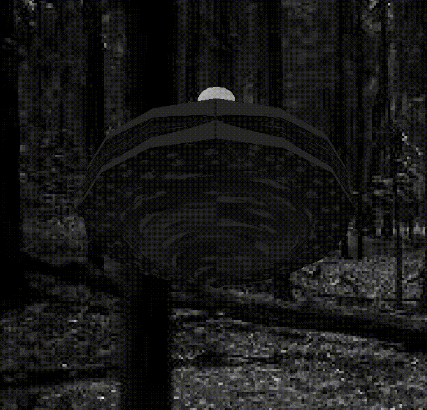
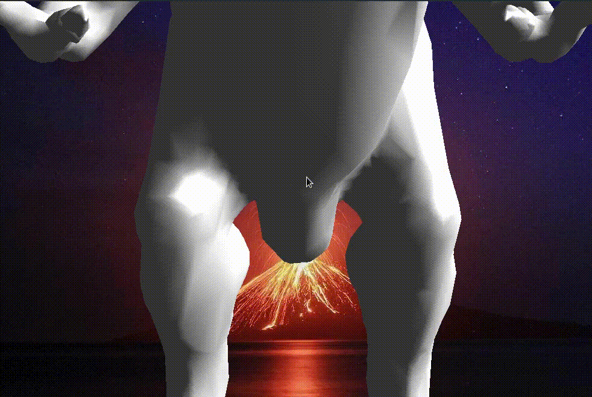

# graphics_java

# Лаброторна робота №4 Костянтин Леліков КП-71

## Варіант 10

#### Анімація

# Лаброторна робота №5

## Варіант 10

Для лабораторної роботи я вибрав модельку тиранозавра рекса і зробив анімацію переміщення

#### Анімація

# МАОКГ Лаб 6
Леліков К.С. КП-71

Варіант 10

## Результат роботи програми

